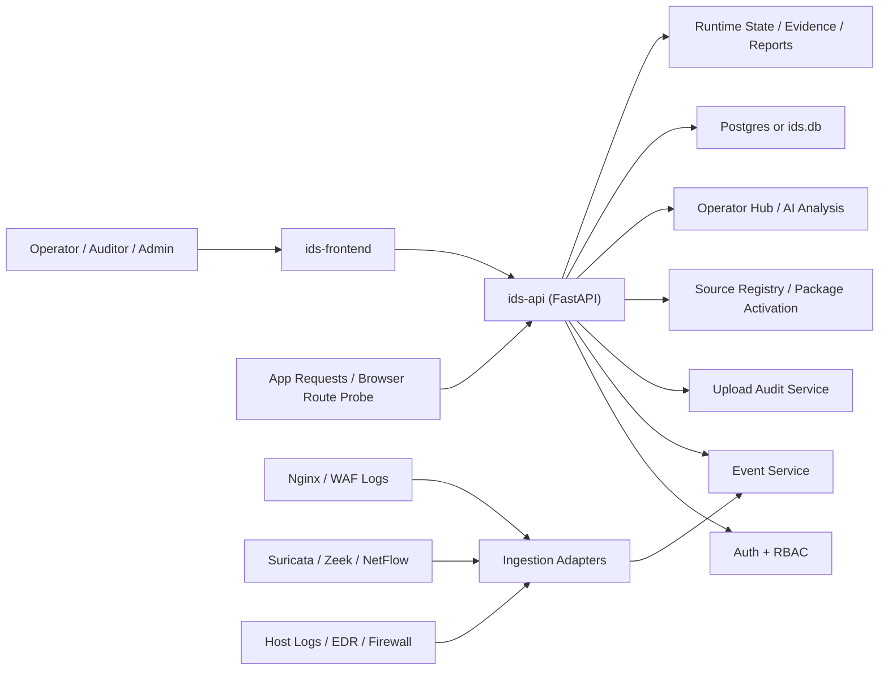

# IDS 独立化技术架构

## 1. 目标

这套独立 IDS 的目标不是继续做“原网站里的一个安全页面”，而是成为一个可以单独开发、单独部署、单独迁移数据、再逐步接入真实流量源的安全子系统。

你现在已经具备的基础很好：

- 独立前端：登录、总览、事件中心、工作台、检测工具、通知、审计、态势、沙箱
- 独立后端：`auth / ids / upload / health`
- 独立数据：`ids.db`
- 独立运行时目录：`runtime/uploads`、`runtime/quarantine`、`runtime/reports`、`runtime/state`
- 独立启动脚本与迁移脚本

下一步重点不是“继续复制原网站代码”，而是把它变成一个边界清晰的安全系统。

## 2. 建议的总体架构

## 3. 组件分层

### 3.1 展示层

- `ids-frontend`
- 只负责登录、事件检索、分析工作台、送检、通知配置、审计与态势展示
- 不再依赖原单体导航、路由或角色体系

### 3.2 控制平面

- `ids-api`
- 负责鉴权、事件检索、规则源管理、样本送检、告警处置、报表导出
- 这是你现在最成熟的部分，可以继续作为独立系统主入口

### 3.3 检测平面

分成两类：

- 同步检测
  - 应用层请求探测
  - 浏览器路由探测
  - 上传样本审核
- 异步检测
  - WAF / Nginx / OpenResty 日志接入
  - Suricata / Zeek / NetFlow 结果接入
  - 主机侧安全日志接入

同步检测用于“实时阻断或实时告警”，异步检测用于“补充证据、态势分析、扩大覆盖面”。

### 3.4 数据平面

建议分三层存储：

- 事务数据
  - 用户、事件、审计、规则源、规则包激活记录
  - 开发期可用 SQLite，生产建议迁到 PostgreSQL
- 运行态数据
  - 误报学习状态、运行时缓存、规则激活状态
  - 可以先保留文件目录，后续逐步迁到 Redis 或独立状态表
- 证据数据
  - 隔离样本、分析报告、上传原件
  - 建议独立目录或对象存储，不要混在源码里

## 4. 你这套 IDS 最适合的演进路线

### 阶段 A：先做成稳定独立系统

目标是“离开原网站也能自跑”：

- 独立根目录
- 独立启动与迁移
- 独立账号与角色
- 独立前后端发布
- 独立数据目录

你现在基本已经走到这一步，接下来要收口的是剩余硬编码路径和文档。

### 阶段 B：把当前单体式后端拆成明确模块

后端建议按职责继续拆分，而不是继续把能力都堆进 `app/api/ids.py`：

- `auth`
  - 登录、令牌、角色
- `events`
  - 事件查询、筛选、处置、归档、详情
- `sources`
  - 规则源、同步、包预览、激活
- `upload`
  - 文件送检、隔离、报告
- `analytics`
  - F2 分析工作台、聚类、画像、误报学习、AI 研判
- `notifications`
  - 告警配置、通知策略、消息状态
- `reports`
  - 审计导出、事件报表、态势数据

先做“模块化单体”最稳，等接口稳定了，再看是否拆服务。

### 阶段 C：引入异步任务层

当下面这些任务开始变慢时，就该上异步层：

- 规则源同步
- 样本分析
- AI 研判
- 批量导出
- 外部日志接入
- 态势聚合计算

建议新增：

- `ids-worker`
  - 消费后台任务
- `Redis`
  - 任务队列 / 缓存

这样 `ids-api` 只保留实时接口，重任务交给 worker。

### 阶段 D：接入真实流量源

这是 IDS 真正从“应用内安全功能”进化到“安全子系统”的关键阶段。

优先级建议：

1. Nginx / OpenResty / WAF 日志
2. Suricata 规则结果
3. Zeek / NetFlow
4. 主机日志 / EDR / 防火墙

原因很简单：先接 Web 入口最贴近你现在已经有的 Web 攻击检测能力，也最容易和现有事件模型合并。

## 5. 推荐的部署形态

### 开发 / 演示

- `ids-frontend`
- `ids-api`
- SQLite
- 本地文件运行时目录

### 小规模生产

- `ids-frontend`
- `ids-api`
- `ids-worker`
- PostgreSQL
- Redis
- 独立证据目录或 NAS

### 成熟生产

- `ids-frontend`
- `ids-api`
- `ids-worker`
- `ingestion-adapters`
- PostgreSQL
- Redis
- 对象存储
- Nginx / WAF / Suricata / Zeek / 主机日志接入

## 6. 现在最该先做的 8 件事

1. 把 `ids-backend/ids.db` 和 `ids-backend/runtime/` 从源码视角当成运行时数据，不再当“工程文件”。
2. 把旧单体路径全部改成可配置，避免继续依赖目录碰巧一致。
3. 为独立 IDS 增加自己的 `README`、环境变量说明和部署说明。
4. 把 `app/api/ids.py` 按职责拆分，先拆 `events / sources / analytics / reports / notifications`。
5. 给“外部日志接入”定义统一事件适配接口，不要未来每接一个源就直接往核心逻辑里塞。
6. 把规则同步、样本分析、AI 研判准备成异步任务接口。
7. 明确证据数据保存策略，避免上传样本和报告长期堆在源码树里。
8. 为独立系统建立自己的版本控制边界、构建边界和部署边界。

## 7. 一句话结论

对你这套系统来说，最合适的路线不是“继续挂回原网站”，而是：

先把它做成模块化单体的独立 IDS，再逐步补异步任务层和外部流量接入层。

这样风险最低、复用现有成果最多，也最符合你目前已经完成的拆分状态。
