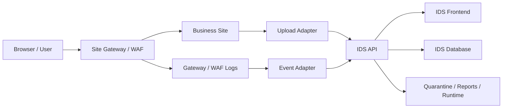
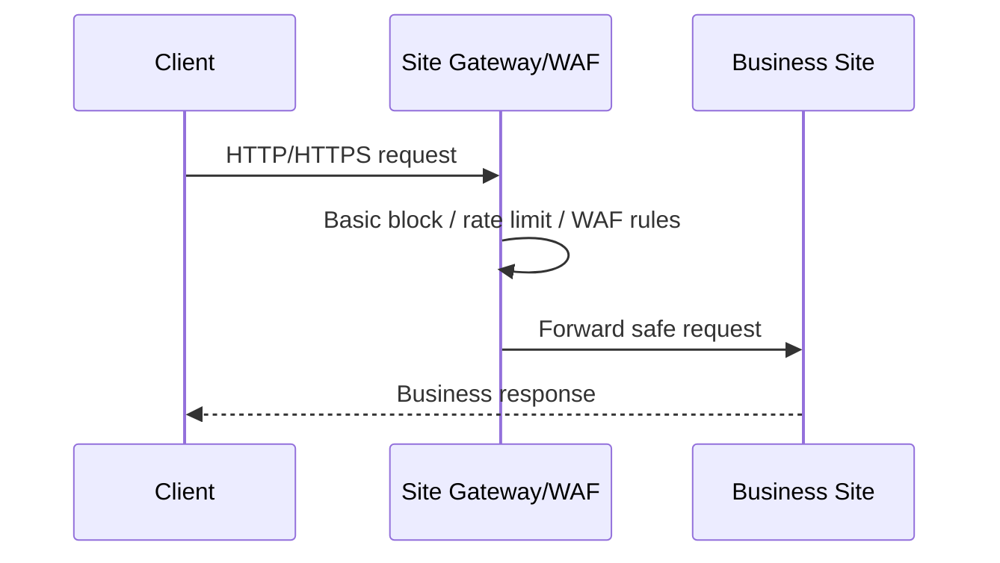
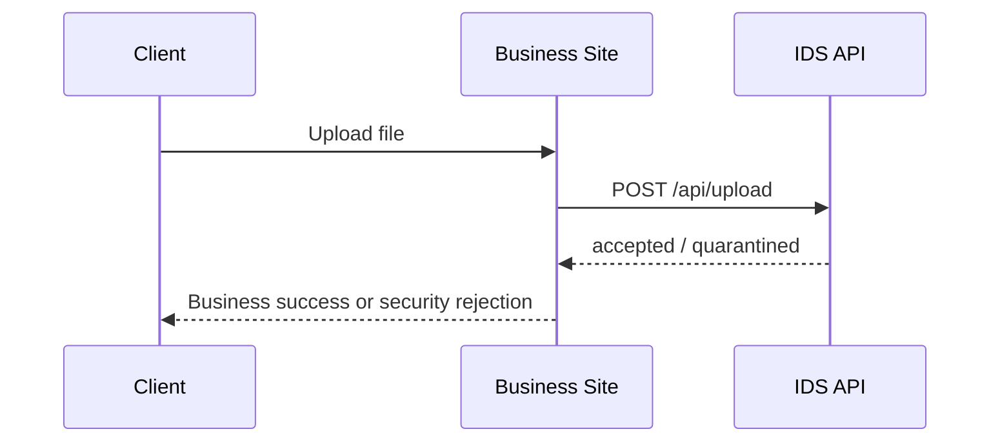
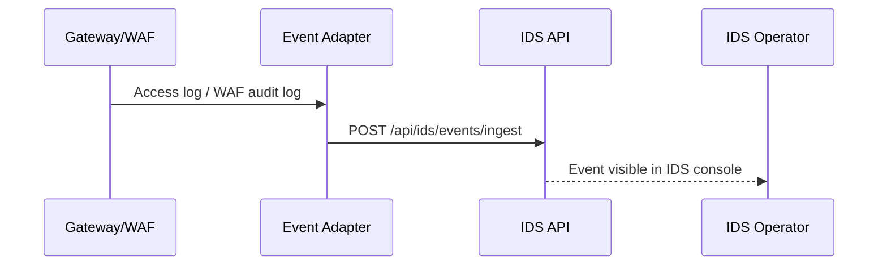

# 网站专用 IDS 接入蓝图

## 1. 目标

这份蓝图面向“未来新版网站”，目标是让网站新增再多内容，也尽量不影响独立 IDS 的主体结构。

核心原则：

- 网站所有流量先过网关
- 网站所有上传统一走 IDS 扫描
- 安全事件统一投递到 IDS
- 安全控制台继续独立部署

## 2. 总体结构

## 3. 三条关键链路

### 3.1 请求链路

说明：

- 网关负责统一入口
- 业务站不再承担第一层网络防护职责
- 网关阻断事件通过日志适配器回传 IDS

### 3.2 上传链路

说明：

- 上传安全判断由 IDS 统一输出
- 业务站只消费结果
- 不建议浏览器直接上传到 IDS

### 3.3 事件链路

## 4. 每层职责

### 4.1 Site Gateway / WAF

职责：

- 统一入口
- 基础限流
- 基础规则阻断
- 转发真实来源 IP
- 输出访问日志 / WAF 审计日志

不负责：

- 复杂事件运营
- 文件 AI 分析
- 告警工作台

### 4.2 Business Site

职责：

- 承载业务逻辑
- 处理登录、业务权限、业务数据
- 调用 IDS 的上传扫描接口
- 可选回传关键安全审计

不负责：

- 自建一套独立安全工作台
- 自己决定最终文件安全策略

### 4.3 IDS API

职责：

- 文件扫描
- 事件接收
- 事件研判
- 告警与审计
- 隔离与报告

### 4.4 Event Adapter

职责：

- 读取网关/WAF 日志
- 做字段规范化
- 投递到 `POST /api/ids/events/ingest`

## 5. 推荐部署方式

### 5.1 最推荐

- `site.example.com` -> 新版业务站
- `ids.example.com` -> 独立 IDS

这样分域最干净，边界最清晰。

### 5.2 可接受

- `site.example.com`
- `site.example.com/security/ids-console`

这种方式可行，但仍然建议 IDS 前后端逻辑独立部署。

## 6. 新版网站接入顺序

1. 先让所有请求经过网关
2. 先把上传统一改成服务端调用 IDS
3. 先接入网关/WAF 阻断事件
4. 再补业务站关键审计回传
5. 最后再补更细的后台敏感操作审计

## 7. 运维需要准备的环境变量

IDS 后端至少要准备：

- `IDS_INTEGRATION_TOKEN`
- `IDS_DATABASE_URL`
- `IDS_ACCEPTED_UPLOAD_DIR`
- `IDS_QUARANTINE_DIR`
- `IDS_REPORT_DIR`
- `LLM_PROVIDER`
- `LLM_API_KEY` 或 `LLM_BASE_URL`

## 8. 最关键的架构约束

### 8.1 上传扫描必须服务端调用

不要让浏览器直接决定上传是否通过。

### 8.2 事件回传必须标准化

不要让不同模块各自定义不同事件字段。

### 8.3 IDS 控制台必须独立

不要把安全中心重新塞回业务站内部壳子。

## 9. 一句话落地结论

未来新版网站无论新增多少页面和模块，只要守住这三条线：

- 入口统一过网关
- 上传统一进 IDS
- 安全事件统一进 IDS

独立 IDS 就不会再次被业务站结构变化拖着返工。
